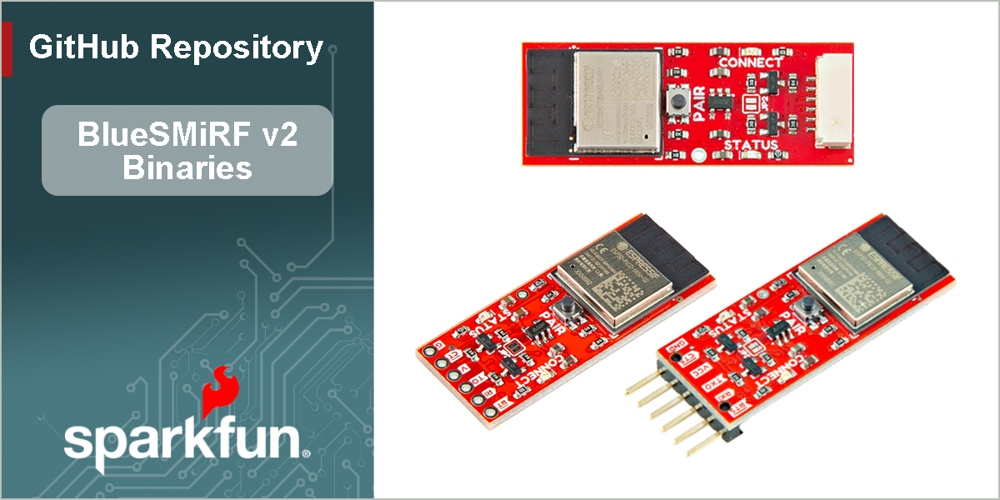

# SparkFun BlueSMiRF v2 - Binaries



This repo houses the compiled binaries for the BlueSMiRF v2 product line. The SparkFun BlueSMiRF v2 is a point to point serial cable replacements using Bluetooth. Simply throw serial characters at a BlueSMiRF v2 and the data will arrive at the other radio, with guaranteed packet delivery. Baud rates supported up to 921600bps!


Instructions
------------
Run the batch file to upload the firmware to your board, where `BlueSMiRF_Firmware_v##.bin` is the firmware binary and `COM##` is the UART port.

```
.\batch_program.bat .\BlueSMiRF_Firmware_v##.bin COM##
```


Repository Contents
-------------------

* **/** - Pre-compiled binaries of SparkFun RTK firmware, suitable for loading (see [Firmware Update](https://docs.sparkfun.com/SparkFun_BlueSMiRF-v2/firmware_update/).).
* **/bin** - Extra files (bootloader, partition, and boot) needed when using esp_tool.
* **/PreviousVersion** - Older versions of the firmware binaries, not recommended for use.


Documentation
--------------

* **[Hookup Guide](http://docs.sparkfun.com/SparkFun_BlueSMiRF-v2/)** - Basic hookup guide for the BlueSMiRF v2 PTH and header versions.
* **[GitHub Hardware Repo](https://github.com/sparkfun/SparkFun_BlueSMiRF-v2/)** - Design files, firmware, and related product documentation.


Product Variants
----------------

- [WRL-24113](https://www.sparkfun.com/sparkfun-bluesmirf-v2.html) - Initial release, PTH pads variant
- [WRL-23287](https://www.sparkfun.com/sparkfun-bluesmirf-v2-headers.html) - Initial release, male header pins variant
- [WRL-30414](https://www.sparkfun.com/sparkfun-bluesmirf-v2-jst.html) - Initial release, JST connector variant


License Information
-------------------

This product is _**open source**_!  Please feel free to [contribute](https://docs.sparkfun.com/SparkFun_BlueSMiRF-v2/github/contribute/) to both the firmware and documentation.

Various bits of the code have different licenses applied. Anything SparkFun wrote is beerware; if you see me (or any other SparkFun employee) at the local, and you've found our code helpful, please buy us a round!

Please use, reuse, and modify these files as you see fit. Please maintain attribution to SparkFun Electronics and release anything derivative under the same license.

Distributed as-is; no warranty is given.

- Your friends at SparkFun.
